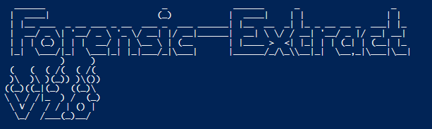
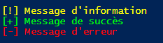

# Forensic-Extract V2.0

Forensic-Extract est un script PowerShell permettant avec un compte administrateur de récupérer différents logs / information sur un poste compromis.  

**Pré-Requis** :
- Compte Administrateur
- PowerShell version 5
- Un endroit où stocker les données (USB, Disque partagé, etc.)

**Fonctionnalités** :
- Test de vérification si le compte est bien administrateur
- Vérification de la version PowerShell installé
- Saisie Utilisateur du lieu où stocker les logs
- Création d'un dossier avec le nom du poste et la date actuelle.
- Récupération de journaux au format `evtx`
- Résupération des information du poste au format `.txt`
- Résultat final archivé au format `.zip`

## Comment-ça marche ?

L'utilisation est très simple, il suffit d'éxecuter le script avec un compte Administrateur.  
Le script va démarrer ses premières vérifications et vous demander où sauvegarder les logs.  

Si le chemin saisie par l'utiisateur existe, un dossier nommé avec le nom du poste et la date va être créer.  
Ce dossier va contenir les logs et va être ensuite compressé en archive `.zip`.  

En cas d'erreur importante (Mauvais Chemin, Pas assez de droits pour le compte, etc.) le script va s'arrêter.

Si une commandes de récupération d'un fichier logs ne fonctionne pas, une erreur va apparaître mais le script ne va pas s'arrêter.  

## **Les indicateurs**

